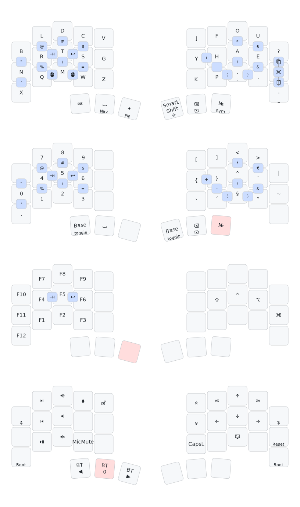

# Toucan Keyboard — Gallium ZMK Config

Custom ZMK firmware for the [beekeeb Toucan Keyboard](https://beekeeb.com/toucan-keyboard/) using the **Gallium v2** Columnar Staggered layout, optimised for Swiss German (DE-CH) input.

This config uses the **5-col layout** (outer pinky columns unused), making key positions identical to the Piantor Pro BT config for easy cross-board maintenance.

---

## Keymap Overview



---

## Layer Overview

### Gallium (Layer 0) — Default

[Gallium](https://github.com/GalileoBlues/Gallium) is an alternative layout designed to minimise same-finger bigrams and lateral stretches. This config uses the columnar-staggered version with X and Q swapped.

```
B  L  D  C  V  |  J  Y  O  U  ?/!
N  R  T  S  G  |  P  H  A  E  I
X  Q  M  W  Z  |  K  F  ,/; ./: -/_
```

**Hold-tap keys on the base layer:**

- `,` → `;` · `.` → `:` · `-` → `_` · `?` → `!`

**Home row mods** (cross-hand activation only, balanced flavor):

- Left: `N`=Super · `R`=Alt · `T`=Ctrl · `S`=Shift
- Right: `H`=Shift · `A`=Ctrl · `E`=Alt · `I`=Super

**Thumb cluster:**

```
ESC | Space (hold: Bridge) | MagicKey (hold: Helm) | Glyph | Backspace | Del
```

---

### Thumb Key Behaviours

| Key | Tap | Hold |
|---|---|---|
| **Space** | Plain space | Bridge layer (nav/sys) |
| **MagicKey** | Adaptive key (see below) | Helm layer (fn/mouse) |
| **Glyph** | `num_word` (auto-exit number layer) | Momentary Glyph layer |

#### Magic Key — Adaptive Substitutions

The Magic Key repeats the last key by default, but applies smart substitutions for common bigrams:

| After typing | Magic Key outputs |
|---|---|
| `C` | `H` |
| `E` | `U` |
| `H` | `Y` |
| `L` | `K` |
| `N` | `D` |
| `P` | `H` |
| `Q` | `U` |
| `R` | `L` |
| `S` | `C` |
| `T` | `M` |
| `-` | `>` (producing `->`) |
| `a` / `A` | `ä` / `Ä` |
| `o` / `O` | `ö` / `Ö` |
| `u` / `U` | `ü` / `Ü` |
| anything else | key repeat |

Umlaut substitutions have a 1-second timeout; all others have a 5-second window.

---

### Glyph (Layer 1) — Numbers and Symbols

Activated by tapping Glyph thumb (`num_word` — auto-exits on non-number/symbol keys) or holding Glyph thumb (momentary).

```
 —   7   8   9   —  |  [   ]   <   >   |
 0   4   5   6   —  |  {   }   ^   `   ~
 .   1   2   3   —  |  ´   §   °   —   —
```

Home row mods mirror the base layer on both sides.

---

### Helm (Layer 2) — Function Keys and Mouse

Activated by holding MagicKey thumb **or by touching the trackpad** (touch processor fires `mo 2`).

```
F10  F7  F8  F9   —  |   —    —     —     —     —
F11  F4  F5  F6   —  |   —   RSft  RCtl  RAlt  RGui
F12  F1  F2  F3   —  |   —    —     —     —     —
```

**Thumb cluster:** `—` | `—` | `trans` | LClick | RClick | MClick

The right side raw modifiers allow `Shift/Ctrl/Alt/Super + Fn` combinations. Mouse clicks are on the thumb cluster — reachable while the trackpad hand moves the cursor.

---

### Bridge (Layer 3) — Navigation and System

Activated by holding Space thumb. **Trackpad acts as scroll wheel on this layer.**

```
BtClrAll**  Next  VolUp  RGB_OFF  StudioUnlk  |  PgUp  Home   Up    End    BtClr**
    —       Prev  VolDn    —          —        |  PgDn  Left  Down  Right  Reset**
  Boot**    Play  Mute   MicMute      —        |  CapsW CapsL PrtSc   —    Boot**
```

- `MicMute` = `LGui+RAlt+K` shortcut
- `CapsW` = Caps Word (auto-deactivates at word boundary)
- `**` = tap-dance safety: single tap does nothing, double-tap triggers the action

**Thumb cluster:** `BT ◀` | `—` | `BT ▶` | `—` | `—` | `to(Gallium)`

---

## Trackpad Behaviour

The Toucan's Cirque trackpad behaves differently depending on the active layer:

| Layer | Trackpad behaviour |
|---|---|
| **Gallium (0)** | Cursor movement + touch activates Helm (`mo 2`) |
| **Glyph (1)** | Cursor movement only |
| **Helm (2)** | Cursor movement + thumb cluster provides mouse clicks |
| **Bridge (3)** | Scroll wheel (horizontal scroll inverted) |

Pointer speed is set to 2.5× (`zip_xy_scaler 250 100`). Scroll speed is 1/5× (`zip_scroll_scaler 1 5`).

---

## Combos

All combos are active on Gallium and Glyph layers. Tab and Return are also active on Helm.

**Key position reference:**
```
 0=B   1=L   2=D   3=C   4=V     5=J   6=Y   7=O   8=U   9=?
10=N  11=R  12=T  13=S  14=G    15=P  16=H  17=A  18=E  19=I
20=X  21=Q  22=M  23=W  24=Z    25=K  26=F  27=,  28=.  29=-
              30    31    32      33    34    35
```

**Whitespace (horizontal home row):**

- `R+T` → Tab
- `T+S` → Return

**Symbols — left hand vertical:**

| Top+Home | Output | Home+Bottom | Output |
|---|---|---|---|
| `B+N` | `""` ← cursor | `N+X` | `'` |
| `L+R` | `@` | `R+Q` | `%` |
| `D+T` | `#` | `T+M` | `\` |
| `C+S` | `$` | `S+W` | `=` |

**Symbols — right hand vertical:**

| Top+Home | Output | Home+Bottom | Output |
|---|---|---|---|
| `Y+H` | `+` | `H+F` | `-` |
| `O+A` | `*` | `A+,` | `/` |
| `U+E` | `€` | `E+.` | `&` |
| `?+I` | Copy | `I+-` | Paste |
| `?+-` | Cut (top+bottom pinky stretch) | | |

**Brackets — right hand horizontal (bottom row):**

- `K+F` → `()`← cursor between
- `F+,` → `(`
- `,+.` → `)`

---

## Flashing Firmware

### Download

1. Go to the **Actions** tab → latest successful build
2. Download the `firmware` artifact and extract the `.zip`

### Flash (Linux)

Each half must be flashed separately. Double-press the reset button to enter bootloader — it mounts as `XIAO-SENSE`.

```bash
# Left half
udisksctl mount -b /dev/disk/by-label/XIAO-SENSE && \
  cp ~/Downloads/firmware/seeeduino_xiao_ble_toucan_left-zmk.uf2 /run/media/$USER/XIAO-SENSE/

# Right half
udisksctl mount -b /dev/disk/by-label/XIAO-SENSE && \
  cp ~/Downloads/firmware/seeeduino_xiao_ble_toucan_right-zmk.uf2 /run/media/$USER/XIAO-SENSE/
```

---

## Modifying the Config

1. Edit `config/toucan.keymap`, `config/toucan_behaviors.dtsi`, or `config/toucan_combos.dtsi`
2. Push → GitHub Actions builds automatically
3. Download the firmware artifact from the Actions tab

The keymap, behaviors, and combos use **identical key positions** to the [Piantor Pro BT config](https://github.com/Leichenfaust44/zmk-config) — changes can be ported between boards with minimal adaptation.

**Tools:**
- [ZMK Studio](https://zmk.studio/download) — GUI editor (use Studio Unlock on Bridge layer)
- [keymap-drawer](https://github.com/caksoylar/keymap-drawer) — SVG keymap visualiser (auto-generated on push)

---

## License

Based on [ZMK Firmware](https://zmk.dev), MIT License.

The included shield `nice_view_gem` is modified from [M165437/nice-view-gem](https://github.com/M165437/nice-view-gem), MIT License.

The embedded font QuinqueFive is designed by GGBotNet, licensed under the SIL Open Font License, Version 1.1.
